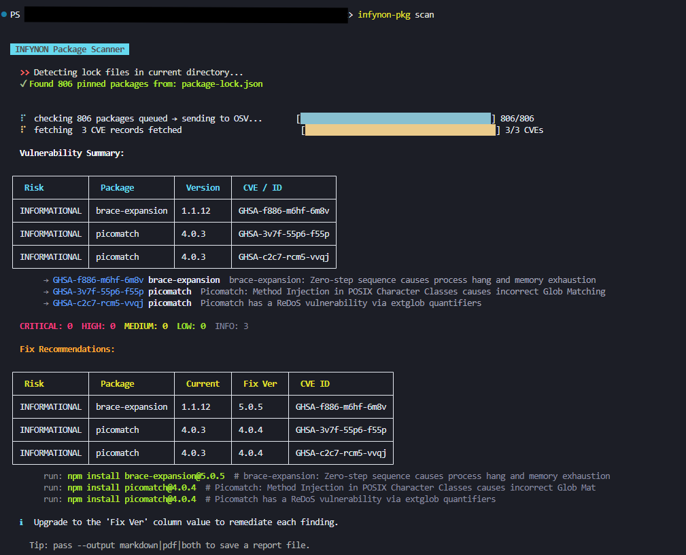
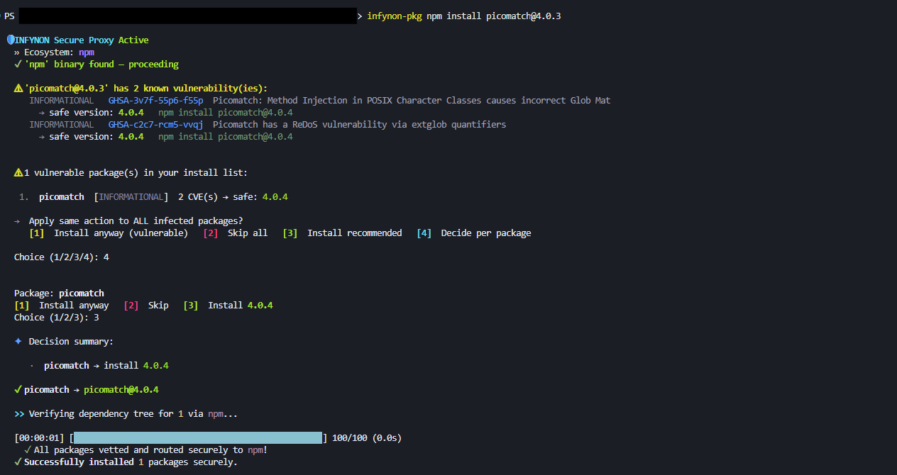

<p align="center">
  <h1 align="center">🛡️ INFYNON</h1>
  <p align="center">
    <strong>Network Firewall & Dependency Security Manager</strong><br/>
    Real-time reverse proxy WAF with TUI dashboard + pre-install CVE verification for 14 ecosystems.
  </p>
</p>

<p align="center">
  <a href="https://github.com/d4rkNinja/infynon-cli/stargazers">
    
  </a>
  <a href="https://github.com/d4rkNinja/infynon-cli/issues">
    
  </a>
  <a href="https://github.com/d4rkNinja/infynon-cli/blob/main/LICENSE">
    
  </a>
  
  
  
  <a href="https://github.com/d4rkNinja/infynon-cli/tree/development">
    
  </a>
</p>

<p align="center">
  <strong>🚫 Traditional tools scan AFTER install</strong><br/>
  <strong>✅ INFYNON blocks vulnerabilities BEFORE install</strong>
</p>

<p align="center">
  <a href="#-quick-start">Quick Start</a> •
  <a href="#-why-infynon">Why INFYNON</a> •
  <a href="#-how-it-works">How It Works</a> •
  <a href="#-key-features">Features</a> •
  <a href="#-firewall-mode-v020">Firewall</a> •
  <a href="#-installation">Install</a> •
  <a href="#-development-channel">Dev Channel</a> •
  <a href="docs/commands.md">Commands</a>
</p>

---

## ⚡ What is INFYNON?

INFYNON is a **dual-mode security tool** written in Rust:

1. **`infynon` (Firewall Mode)** — A real-time reverse proxy WAF that sits between the internet and your backend, inspecting and filtering every HTTP request with a beautiful TUI dashboard.
2. **`infynon pkg` (Package Manager Mode)** — A universal pre-installation firewall for dependencies across 14 ecosystems.

### Firewall Mode (NEW in v0.2.0)

```
Internet → INFYNON Firewall → Nginx / App Server → Your Application
```

INFYNON acts as a **self-hosted Cloudflare WAF** — IP filtering, rate limiting, SQL injection detection, XSS protection, custom rules, all with a real-time TUI monitor.

### Package Manager Mode

INFYNON is also a **universal package security CLI** that acts as a **pre-installation firewall for dependencies**.

Modern development relies heavily on third-party packages — but every install introduces risk.

Most tools like `npm audit`, `pip audit`, or Dependabot:
- scan **after installation**
- notify you **after exposure**
- require manual remediation

INFYNON changes this workflow.

> It **intercepts package installation**, analyzes dependencies in real-time,  
> and blocks or fixes vulnerabilities *before they enter your system*.

---

## 🎯 Why INFYNON?

### The Problem

- Developers install packages blindly
- Vulnerabilities are discovered **too late**
- Supply chain attacks are increasing (typosquatting, malicious updates)
- Existing tools are **reactive, not preventive**

---

### The Shift

INFYNON introduces a **"shift-left security model"**:

| Traditional Flow | INFYNON Flow |
|-----------------|-------------|
| Install → Scan → Fix | Scan → Decide → Install |

This simple shift prevents:
- vulnerable dependencies entering your codebase
- production risks caused by unnoticed CVEs
- wasted time on post-install fixes

---

## ⚙️ How It Works

1. **Intercept install command**
  ```bash
   infynon pkg npm install express
  ```

2. **Resolve dependency tree**

   * Detects ecosystem automatically
   * Parses lock files or registry metadata

3. **Query vulnerability database**

   * Uses **OSV.dev** for real CVE intelligence
   * Batch scans all dependencies

4. **Analyze & classify**

   * Severity levels (Critical / High / Medium / Low)
   * Affected versions
   * Suggested safe upgrades

5. **Interactive decision layer**

   * Approve / Skip / Upgrade per package
   * Apply rules globally

6. **Execute safe installation**

   * Only installs approved or fixed packages

---

## 🚀 Key Features

### 🔐 Security First

* **Pre-install CVE scanning**
* Blocks vulnerable packages before execution
* OSV-powered vulnerability intelligence

### 🌍 Multi-Ecosystem Support

Supports **14 ecosystems**:

```
npm • yarn • pnpm • bun  
pip • uv • poetry  
cargo • go  
gem • composer • nuget  
hex • pub
```

---

### 🧠 Smart Detection

* Auto-detects ecosystem from project files
* Supports **15+ lock file formats**
* Works without configuration

---

### ⚡ Developer Experience

* Interactive install prompts
* Minimal friction workflow
* Single binary — no setup required

---

### 🛠️ Auto Remediation

* `infynon pkg fix --auto` upgrades all vulnerable dependencies
* `infynon pkg scan --fix high` targets critical + high only
* Suggests safe versions from OSV.dev

---

### 🚫 CI Enforcement

```bash
infynon pkg --strict npm install express
```

* Fails build on any vulnerability
* Ideal for pipelines and teams

---

### 📄 Reporting

* Export results as Markdown or PDF
* Includes CVE details, severity breakdown, upgrade suggestions

---

### 🔬 Dependency Intelligence

| Command | Description |
|---------|-------------|
| `infynon pkg audit` | Recursive dependency tree with CVE annotations |
| `infynon pkg why <pkg>` | Trace why a package is in your tree |
| `infynon pkg outdated` | Detect outdated deps across all ecosystems |
| `infynon pkg diff <pkg> v1 v2` | Compare versions: size, deps, scripts, CVEs |
| `infynon pkg doctor` | Health check: dupes, unused, phantoms, missing locks |
| `infynon pkg size <pkg>` | Install weight and transitive dep count |
| `infynon pkg search <query>` | Cross-ecosystem search (npm, crates, PyPI, …) |
| `infynon pkg clean` | Find and remove unused dependencies |
| `infynon pkg migrate <from> <to>` | Migrate between package managers |

---

## 👀 Demo

### 🔎 Dependency Scan

<p align="center">
  
</p>

### 🛡️ Secure Installation Flow

<p align="center">
  
</p>

---

## ⚡ Quick Start

```bash
# Scan project dependencies for CVEs
infynon pkg scan

# Secure install — any ecosystem
infynon pkg npm install express
infynon pkg cargo add serde
infynon pkg pip install requests

# Auto-fix all vulnerable dependencies
infynon pkg fix --auto

# Deep audit with dependency tree
infynon pkg audit

# Why is a package in the tree?
infynon pkg why lodash

# Check for outdated deps
infynon pkg outdated

# Compare two versions of a package
infynon pkg diff express 4.17.1 4.18.2

# Dependency health check
infynon pkg doctor

# Package size & weight
infynon pkg size express

# Cross-ecosystem search
infynon pkg search http-client

# Remove unused deps
infynon pkg clean

# Migrate npm → pnpm
infynon pkg migrate npm pnpm

# Export PDF report
infynon pkg scan --output pdf

# Strict mode for CI
infynon pkg --strict npm install express
```

---

## 🔥 Installation

### Linux / macOS

```bash
curl -fsSL https://raw.githubusercontent.com/d4rkNinja/infynon-cli/main/scripts/install.sh | bash
```

### Windows (PowerShell)

```powershell
irm https://raw.githubusercontent.com/d4rkNinja/infynon-cli/main/scripts/install.ps1 | iex
```

### Using Cargo

```bash
cargo install --git https://github.com/d4rkNinja/infynon-cli
```

---

## 🧬 Philosophy

> Security should not be an afterthought.
> It should be enforced by default.

INFYNON ensures that:

* every dependency is verified
* every install is intentional
* every project remains secure by design

---

## 🔥 Firewall Mode (v0.2.0)

INFYNON now includes a **real network firewall** — a reverse proxy that inspects, filters, and blocks HTTP traffic in real time.

### Quick Start — Firewall

```bash
# Initialize configuration
infynon init --port 8080 --upstream-port 3000

# Start firewall with TUI dashboard
infynon start

# Start in headless mode (no TUI)
infynon start --headless

# View status
infynon status

# Block an IP
infynon block 203.0.113.50

# View logs
infynon logs --verdict block --count 100

# Validate config
infynon config check
```

### Firewall Features

| Feature | Description |
|---------|-------------|
| **Reverse Proxy** | Sits between internet and your backend, forwards clean traffic |
| **IP Filtering** | Blocklist, allowlist, CIDR range blocking |
| **Auto-Reputation** | Automatically bans IPs that get blocked too many times |
| **Rate Limiting** | Per-IP, per-path, and global rate limits with sliding window |
| **WAF Engine** | SQL injection, XSS, path traversal, command injection detection |
| **Custom Rules** | IF-THEN rules with combinable conditions and priority ordering |
| **TUI Dashboard** | 7 real-time views: Dashboard, Live Feed, Blocked, IP Inspector, Rules, Stats, Config |
| **JSONL Logging** | Structured event logging with separate blocked request log |
| **Config from TUI** | Edit firewall settings directly from the terminal UI |
| **Hot Config** | Edit `infynon.toml` — changes apply on restart |
| **Cross-Platform** | Works on Linux, macOS, and Windows |

### TUI Views

| Key | View | Description |
|-----|------|-------------|
| `1` | Dashboard | Live stats, sparklines, top IPs, top rules, recent events |
| `2` | Live Feed | All requests in real time with filtering |
| `3` | Blocked | Blocked requests with rule and reason details |
| `4` | IP Inspector | Search any IP — see full history, block/unblock |
| `5` | Rules | Custom rules with hit counts, enable/disable |
| `6` | Stats | Traffic breakdown, status codes, top paths |
| `7` | Config | Edit settings directly from TUI |

### Configuration

Copy `infynon.example.toml` to `infynon.toml` and customize, or run `infynon init` for interactive setup. The config is also editable from the TUI Config view.

---

## ⚠️ Current Scope

INFYNON currently focuses on:

* **Firewall**: Reverse proxy WAF with real-time TUI monitoring
* **Package Security**: Known vulnerabilities (CVE-based detection), pre-install interception
* **Cross-platform**: Single binary for Linux, macOS, Windows

---

## 🧪 Development Channel

Want to try the latest features before they hit stable? Follow the **development** branch:

```bash
# Clone the development branch
git clone -b development https://github.com/d4rkNinja/infynon-cli.git
cd infynon-cli

# Build from source
cargo build --release

# Or install directly from development branch
cargo install --git https://github.com/d4rkNinja/infynon-cli --branch development
```

The `development` branch contains:
- Bleeding-edge features still under testing
- Firewall TUI improvements and new views
- Experimental WAF rules and pipeline stages
- Performance optimizations before release

> **Note**: The development branch may have breaking changes. For production use, stick to tagged releases on `main`.

**Watch the branch** for updates: [github.com/d4rkNinja/infynon-cli/tree/development](https://github.com/d4rkNinja/infynon-cli/tree/development)

---

## 🔮 Upcoming

* Geo-IP blocking (MaxMind GeoLite2 integration)
* SQLite event database for historical queries
* Webhook alerts (Slack, Discord, email)
* LLM-based deep inspection (Layer 3 — local Ollama)
* AI-powered anomaly detection and rule suggestion
* SBOM generation (CycloneDX) after every install
* TLS termination support
* Maintenance mode

